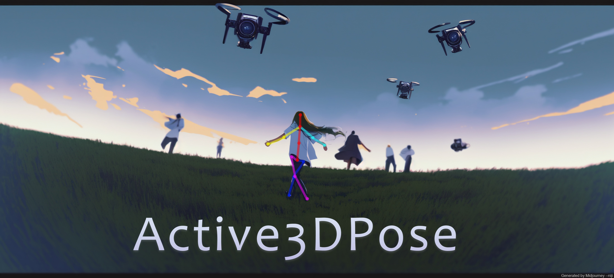

# Active3DPose

<p align="center">
  
</p>

This code supplements the following paper:

> [Proactive Multi-Camera Collaboration for 3D Human Pose Estimation (ICLR 2023)](https://openreview.net/pdf?id=CPIy9TWFYBG)

<div align="center">

  
  .svg?logo=)
  <a href="https://github.com/Embracing/Active-Pose/blob/main/LICENSE">![License](https://img.shields.io/github/license/metaopt/torchopt?label=license&logo=data:image/svg+xml;base64,PHN2ZyB4bWxucz0iaHR0cDovL3d3dy53My5vcmcvMjAwMC9zdmciIHZpZXdCb3g9IjAgMCAyNCAyNCIgd2lkdGg9IjI0IiBoZWlnaHQ9IjI0IiBmaWxsPSIjZmZmZmZmIj48cGF0aCBmaWxsLXJ1bGU9ImV2ZW5vZGQiIGQ9Ik0xMi43NSAyLjc1YS43NS43NSAwIDAwLTEuNSAwVjQuNUg5LjI3NmExLjc1IDEuNzUgMCAwMC0uOTg1LjMwM0w2LjU5NiA1Ljk1N0EuMjUuMjUgMCAwMTYuNDU1IDZIMi4zNTNhLjc1Ljc1IDAgMTAwIDEuNUgzLjkzTC41NjMgMTUuMThhLjc2Mi43NjIgMCAwMC4yMS44OGMuMDguMDY0LjE2MS4xMjUuMzA5LjIyMS4xODYuMTIxLjQ1Mi4yNzguNzkyLjQzMy42OC4zMTEgMS42NjIuNjIgMi44NzYuNjJhNi45MTkgNi45MTkgMCAwMDIuODc2LS42MmMuMzQtLjE1NS42MDYtLjMxMi43OTItLjQzMy4xNS0uMDk3LjIzLS4xNTguMzEtLjIyM2EuNzUuNzUgMCAwMC4yMDktLjg3OEw1LjU2OSA3LjVoLjg4NmMuMzUxIDAgLjY5NC0uMTA2Ljk4NC0uMzAzbDEuNjk2LTEuMTU0QS4yNS4yNSAwIDAxOS4yNzUgNmgxLjk3NXYxNC41SDYuNzYzYS43NS43NSAwIDAwMCAxLjVoMTAuNDc0YS43NS43NSAwIDAwMC0xLjVIMTIuNzVWNmgxLjk3NGMuMDUgMCAuMS4wMTUuMTQuMDQzbDEuNjk3IDEuMTU0Yy4yOS4xOTcuNjMzLjMwMy45ODQuMzAzaC44ODZsLTMuMzY4IDcuNjhhLjc1Ljc1IDAgMDAuMjMuODk2Yy4wMTIuMDA5IDAgMCAuMDAyIDBhMy4xNTQgMy4xNTQgMCAwMC4zMS4yMDZjLjE4NS4xMTIuNDUuMjU2Ljc5LjRhNy4zNDMgNy4zNDMgMCAwMDIuODU1LjU2OCA3LjM0MyA3LjM0MyAwIDAwMi44NTYtLjU2OWMuMzM4LS4xNDMuNjA0LS4yODcuNzktLjM5OWEzLjUgMy41IDAgMDAuMzEtLjIwNi43NS43NSAwIDAwLjIzLS44OTZMMjAuMDcgNy41aDEuNTc4YS43NS43NSAwIDAwMC0xLjVoLTQuMTAyYS4yNS4yNSAwIDAxLS4xNC0uMDQzbC0xLjY5Ny0xLjE1NGExLjc1IDEuNzUgMCAwMC0uOTg0LS4zMDNIMTIuNzVWMi43NXpNMi4xOTMgMTUuMTk4YTUuNDE4IDUuNDE4IDAgMDAyLjU1Ny42MzUgNS40MTggNS40MTggMCAwMDIuNTU3LS42MzVMNC43NSA5LjM2OGwtMi41NTcgNS44M3ptMTQuNTEtLjAyNGMuMDgyLjA0LjE3NC4wODMuMjc1LjEyNi41My4yMjMgMS4zMDUuNDUgMi4yNzIuNDVhNS44NDYgNS44NDYgMCAwMDIuNTQ3LS41NzZMMTkuMjUgOS4zNjdsLTIuNTQ3IDUuODA3eiI+PC9wYXRoPjwvc3ZnPgo=)</a>

</div>

---
<p align="center">
  <a href="https://sites.google.com/view/active3dpose/home">Project Site (Demo)</a> |
  <a href="https://github.com/Embracing/Active-Pose/tree/RC#getting-started">Getting Started</a> |
  <a href="https://github.com/Embracing/Active-Pose/tree/RC#training">Training with RLlib</a> |
  <a href="https://github.com/Embracing/Active-Pose/tree/RC#evaluation--visualization">Evaluation & Visualization</a> |
  <a href="https://github.com/Embracing/Active-Pose/tree/RC#citation">Citation</a> |
  <a href="https://github.com/Embracing/Active-Pose/blob/RC/LICENSE">License</a>
</p>

--------------------------------------------------------------------------------

### TL;DR

- We simulate human crowds and aerial cameras with UE4 (currently support 4 different environment settings).
- We use Ray RLlib to train the camera agents. The RL agents learn to collaborate with each other to estimate 3D human
  pose in a multi-camera setting.
- We build a dedicated tool to evaluate and visualize the performance of the camera agents.


### Getting Started

--------------------------------------------------------------------------------

#### Project Directory

```
${PROJECT_ROOT}
├── activepose
├── binary
│   ├── < Need to download from external source >
│   └── ...
├── checkpoints
│   ├── < Need to download from external source >
│   └── ...
├── configs
├── experiments
├── run
├── README.md
├── train.py
...
```

#### Preparation

1.Make sure you have the library `gdown` installed.
```bash
pip install gdown
```
```bash
cd {PROJECT_ROOT}
```
2. Under `{PROJECT_ROOT}`, enter to following command to download the pre-trained 2D pose estimation model checkpoint:
```bash
gdown 1_WGlsM0KP5dK3YFILsbvwX4NQ60pn4XC
unzip checkpoints.zip && rm checkpoints.zip
```

3. Download our UE4 Linux binaries and put them under `{PROJECT_ROOT}/binary`

```bash
gdown 11AwSSxrKYA2HKo7224WDpvFPsUHRVBy7
unzip binary.zip && rm binary.zip
```

4. Install conda environment from `conda-recipe.yaml` and activate it.

```bash
conda env create -f conda-recipe.yaml
conda activate active-pose
```

Enter the following command in case of permission issue, running binary require writing permission to the `unrealcv.ini` file:
```bash
chmod -R 755 binary/ && chmod -R 755 checkpoints/
```

5. **(OPTIONAL)** We have provided the option to use TensorRT. Doing so would require the users to compile the model with Torch-TensorRT specific to the spec of their own machines. If you wish to use TensorRT engine to accelerate model inference, please follow the instructions [here](https://docs.nvidia.com/deeplearning/tensorrt/install-guide/index.html).

#### Main Dependencies

- python = 3.9
- pytorch
- ray[rllib] == 1.13.0
- unrealcv
- opencv-python
- pyqt

Please refer to `conda-recipe.yaml` for a complete list of python dependencies.

### Training

Detailed Procedure: [[Training with RLlib]](./docs/train.md)

### Evaluation & Visualization

Detailed Procedure: [[Evaluate Policy and Visualization]](./docs/evaluation.md)

## Need Helps?

Please consider submitting an GitHub issue.

## Citation

```bibtex
@inproceedings{ci2023proactive,
  title={Proactive Multi-Camera Collaboration for 3D Human Pose Estimation},
  author={Hai Ci and Mickel Liu and Xuehai Pan and fangwei zhong and Yizhou Wang},
  booktitle={The Eleventh International Conference on Learning Representations},
  year={2023},
  url={https://openreview.net/forum?id=CPIy9TWFYBG}
}
```

## License

Active3DPose and its associated simulation environment _UnrealPose_ are released under the Apache License, Version 2.0.
