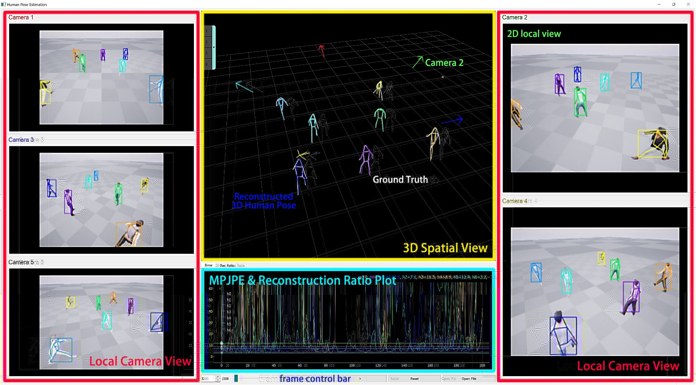
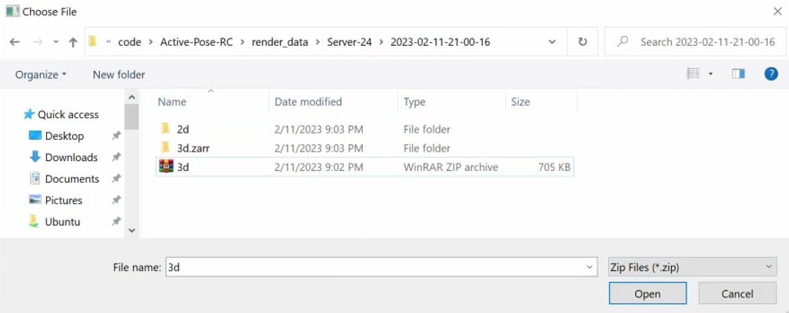
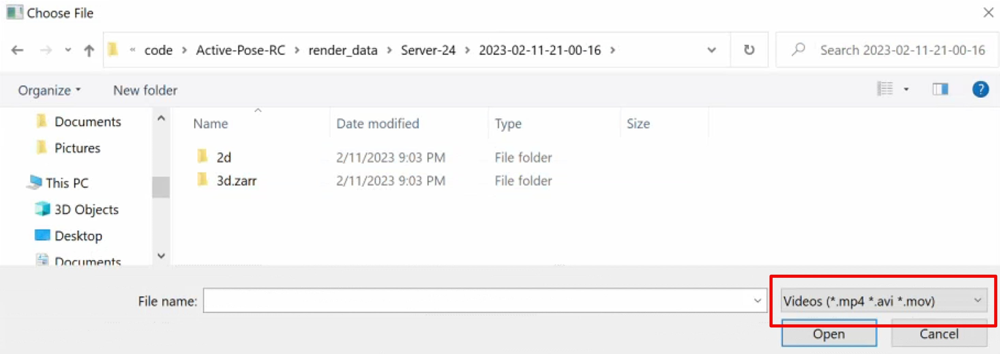
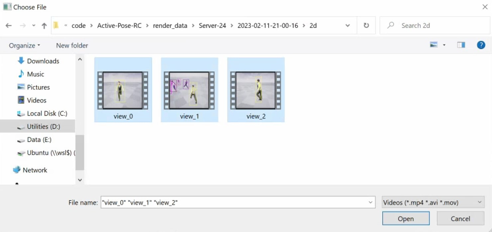

## Evaluate Policy and Visualization
Below is a tutorial on how to evaluate a policy and visualize the results.

### Step 1: Evaluate the policy
```bash
cd {'PATH/TO/PROJECT/DIRECTORY'}
python run/scripts/evaluate.py --ckpt {'PATH/TO/CHECKPOINT'}
```

#### Available arguments

```bash
--num-humans        # Number of humans in the scene
--ckpt              # Path to the checkpoint
--ckpt-num          # Checkpoint number, without the prefix zeros
--env-name          # Environment setup configured under activepose/env_config.py
--map-name          # Map name
--render-steps      # Number of steps to evaluate (or render if --no-render is not specified)
--num-episodes      # Number of episodes to evaluate
--no-render         # Disable rendering (only evaluate the policy, significantly faster)
--use-gt            # Use ground truth 2D pose as input instead of using predicted 2D pose by default
```
An example of evaluating the policy with checkpoint `ray_results/mappo_ctcr_wdl/PPO_1bd01_00000_Feb08/checkpoint_001400/checkpoint_1400`. This is the default pattern generated by Ray RLlib.
```bash
python run/scripts/evaluate.py --ckpt ray_results/mappo_ctcr_wdl/PPO_1bd01_00000_Feb08 --ckpt-num 1400
```
Or you can without specifying the checkpoint number to evaluate the latest checkpoint:
```bash
python run/scripts/evaluate.py --ckpt ray_results/mappo_ctcr_wdl/PPO_1bd01_00000_Feb08
```
If you choose to render the results (that is to not specify `--no-render`), the 3D pose estimation sequences and 2D camera recordings will be saved under the folder
`render_data`.


### Step 2: Using 3DPoseViewer to Visualize

**Note:** make sure to leave render option ON when evaluating the policy.

We develop a interactive tool `3DPoseViewer` to visualize the reconstruction results and learned camera policy. If you would like to use this viewer alone (visualize your own data), please find the instructions [here](https://github.com/Embracing/3DPoseViewer)

#### Quickstart

```bash
cd {ROJECT_ROOT}
python -m run.scripts.visualize
```

#### GUI




#### Load 3D pose estimation sequences from evaluation
1. Click `Open File` and navigate to the folder `render_data/{HOSTNAME}/{PATH_TO_EVALUATION_RESULTS}`.
2. Select the `3d.zip` file and click `Open`.

   

#### Load 2D camera recordings from evaluation
1. Under the same directory as above, there is another folder called `2d`. Click into the folder.
2. Make sure the desired file type is set to `Videos (*.mp4, *.avi, *.mov)` as shown in the figure below.

   
3. Select all mp4 files and click `Open`.

3. 
